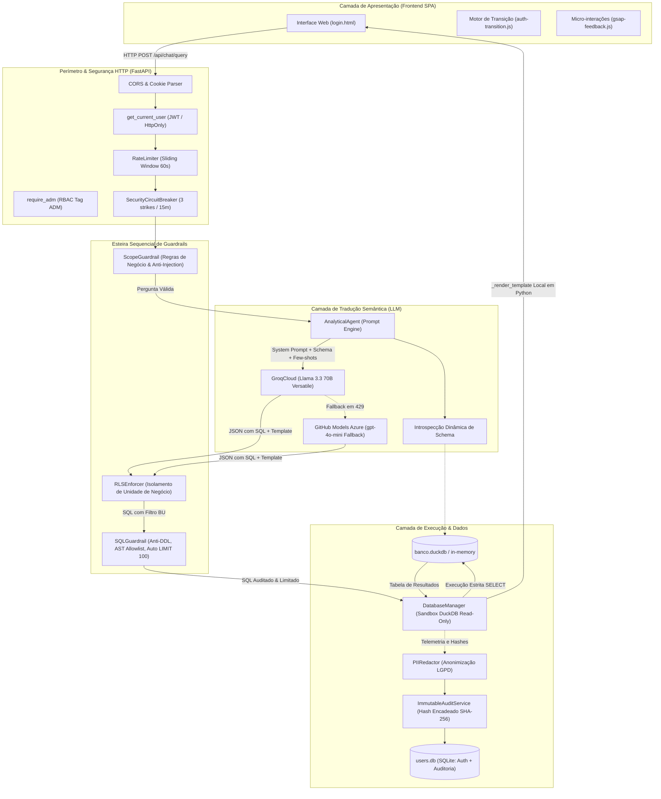
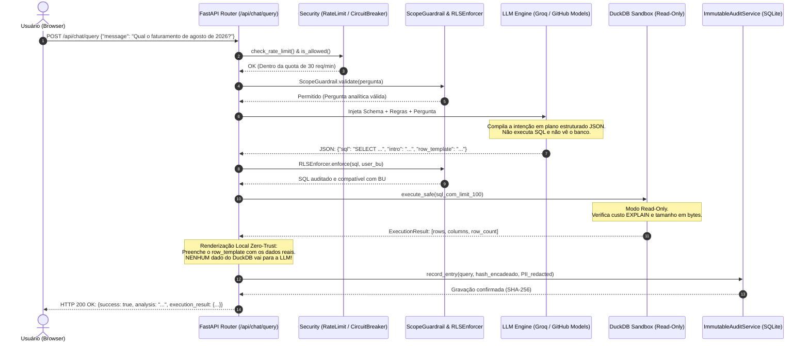

# Milia AI — Agente SQL & Plataforma Analítica Corporativa
## Documentação Técnica Oficial de Arquitetura e Engenharia de Software

> **Versão:** 2.0.0  
> **Status:** Produção / Homologação Corporativa  
> **Linguagem Principal:** Python 3.13+ | JavaScript (ES6+ / GSAP 3.12)  
> **Banco Analítico:** DuckDB (In-Memory / Persistent `.duckdb`)  
> **Banco Operacional & Auditoria:** SQLite (`data/users.db`)  
> **Framework Web:** FastAPI (ASGI / Uvicorn)  

---

## Sumário Executivo

1. [Visão Geral](#1-visão-geral)
   - [O que é o projeto](#11-o-que-é-o-projeto)
   - [Problema de negócio que resolve](#12-problema-de-negócio-que-resolve)
   - [Público-alvo e perfis de acesso](#13-público-alvo-e-perfis-de-acesso)
   - [Principais funcionalidades](#14-principais-funcionalidades)
   - [Stack tecnológica completa](#15-stack-tecnológica-completa)
2. [Arquitetura do Sistema](#2-arquitetura-do-sistema)
   - [Visão arquitetural em camadas](#21-visão-arquitetural-em-camadas)
   - [Diagrama de componentes](#22-diagrama-de-componentes)
   - [Responsabilidades de cada componente](#23-responsabilidades-de-cada-componente)
3. [Fluxo Completo de uma Requisição](#3-fluxo-completo-de-uma-requisição)
   - [As 7 esteiras do pipeline Text-to-SQL](#31-as-7-esteiras-do-pipeline-text-to-sql)
   - [Diagrama de sequência end-to-end](#32-diagrama-de-sequência-end-to-end)
   - [Exemplo prático de Request e Response](#33-exemplo-prático-de-request-e-response)
4. [Integração e Ciclo de Vida da LLM](#4-integração-e-ciclo-de-vida-da-llm)
   - [Provedores suportados e política de failover](#41-provedores-suportados-e-política-de-failover)
   - [Engenharia de prompts e schema dinâmico](#42-engenharia-de-prompts-e-schema-dinâmico)
   - [Estrutura do plano analítico retornado pela IA](#43-estrutura-do-plano-analítico-retornado-pela-ia)
   - [Mecanismo de auto-recuperação (Self-Healing)](#44-mecanismo-de-auto-recuperação-self-healing)
   - [Conhecimento da LLM vs. Contexto fornecido pela aplicação](#45-conhecimento-da-llm-vs-contexto-fornecido-pela-aplicação)
5. [Isolamento da LLM & Filosofia Zero-Trust](#5-isolamento-da-llm--filosofia-zero-trust)
   - [Por que a LLM não acessa sistemas internos](#51-por-que-a-llm-não-acessa-sistemas-internos)
   - [Diagrama de fronteira de privilégio (Trust Boundary)](#52-diagrama-de-fronteira-de-privilégio-trust-boundary)
   - [Matriz de isolamento técnico](#53-matriz-de-isolamento-técnico)
6. [Segurança e Governança](#6-segurança-e-governança)
   - [Autenticação (JWT, Cookies HttpOnly e Remember Me)](#61-autenticação)
   - [Autorização (RBAC e Row-Level Security por BU)](#62-autorização)
   - [Gestão de segredos e credenciais](#63-gestão-de-segredos)
   - [Proteção do banco de dados (Read-Only e AST)](#64-proteção-do-banco-de-dados)
   - [Mitigação de Prompt Injection e Jailbreak](#65-mitigação-de-prompt-injection)
   - [Prevenção de vazamento de dados e Redação PII (LGPD)](#66-prevenção-de-vazamento-de-dados-e-redação-pii-lgpd)
   - [Prevenção de agência excessiva (Excessive Agency)](#67-prevenção-de-agência-excessiva)
   - [Rate Limiting e Circuit Breaker comportamental](#68-rate-limiting-e-circuit-breaker)
   - [Trilha de auditoria imutável com Hash Encadeado (SHA-256)](#69-trilha-de-auditoria-imutável-com-hash-encadeado-sha-256)
7. [Modelo de Ameaças](#7-modelo-de-ameaças)
8. [Arquitetura de Dados: Text-to-SQL vs. RAG](#8-arquitetura-de-dados-text-to-sql-vs-rag)
9. [Ciclo e Classificação dos Dados](#9-ciclo-e-classificação-dos-dados)
10. [Privacidade e Conformidade](#10-privacidade-e-conformidade)
11. [Estrutura Real do Repositório](#11-estrutura-real-do-repositório)
12. [Guia de Execução, Configuração e Testes](#12-guia-de-execução-configuração-e-testes)
13. [Guia de Extensão: Como Adicionar Novas Funcionalidades](#13-guia-de-extensão-como-adicionar-novas-funcionalidades)

---

# 1. Visão Geral

## 1.1 O que é o projeto
O **Milia AI (AgenteSQL)** é uma plataforma analítica corporativa e sistema *Text-to-SQL* com governança em profundidade, desenvolvida para traduzir perguntas de negócio formuladas em português natural em consultas SQL determinísticas, seguras e de alta performance executadas sobre a base analítica da Milia no **DuckDB**.

A aplicação combina um servidor backend assíncrono em **FastAPI**, uma esteira de **7 guardrails de segurança sequenciais**, uma arquitetura de LLM com failover transparente e uma interface web moderna (SPA) com micro-interações vetoriais aceleradas por GPU (**GSAP 3**).

## 1.2 Problema de negócio que resolve
Nas organizações, analistas e gestores dependem frequentemente da equipe de TI ou Controladoria para extrair relatórios simples de faturamento, margem bruta, vendas por produto e desempenho de unidades de negócio. Isso gera:
- **Gargalos operacionais:** Filas de atendimento para relatórios rotineiros.
- **Risco de extração manual insegura:** Arquivos CSV/Excel transitando sem controle de acesso ou auditoria.
- **Inconsistência de métricas:** Diferentes departamentos calculando "faturamento" com regras divergentes.

O Milia AI resolve esses problemas padronizando regras de negócio estritas (ex: *"faturamento é sempre Valor Contábil"*, *"clientes em risco são clientes com margem bruta acumulada negativa"*), aplicando controle de acesso a nível de linha (*Row-Level Security*) por Unidade de Negócio (BU) e entregando respostas estruturadas em milissegundos.

## 1.3 Público-alvo e perfis de acesso
O sistema opera com controle de permissão baseado em papéis (*RBAC*) e etiquetas corporativas (*Tags*):

| Perfil / Tag | Unidade de Negócio (BU) | Escopo de Visualização | Capacidades |
|---|---|---|---|
| **Colaborador Padrão** (`Varejo`) | `Varejo` | Exclusivo da própria BU | Realizar consultas analíticas restritas aos dados de Varejo. |
| **Colaborador Especialista** (`Serviços` ou `Corporativo`) | Respectiva BU | Exclusivo da própria BU | Consultas analíticas restritas à sua divisão. Tentativas de acessar outras BUs são bloqueadas no RLS. |
| **Acesso Global** (`Fiscal`, `Contabil`, `ADM` simultâneos) | Todas | Irrestrito (Consolidado Corporativo) | Consultar métricas consolidadas de todas as BUs, comparações cruzadas e totais corporativos. |
| **Administrador** (`ADM`) | Qualquer | Painel Administrativo Completo | Aprovar novos usuários, alterar tags/status, visualizar trilha de auditoria SHA-256 e incidentes. |

## 1.4 Principais funcionalidades
- **Conversão Text-to-SQL com Auto-Correção:** Geração de consultas DuckDB com CTEs, funções analíticas e autocura sintática (*self-healing*) em até 2 tentativas.
- **Isolamento RLS por Unidade de Negócio:** Injeção compulsória de predicados de BU em tempo de execução para usuários sem privilégio global.
- **Execução Segura em DuckDB (Read-Only):** Conexão estritamente somente leitura, barreira de complexidade computacional via `EXPLAIN`, teto de memória/bytes e `LIMIT 100` automático.
- **Zero-Trust Data Synthesis:** O modelo de IA **nunca** recebe de volta os dados reais retornados pelo banco. O preenchimento da resposta final ocorre localmente no servidor em Python via templates estruturados.
- **Perímetro de Proteção:** Rate limiter em janela deslizante de 60s (30 req/min) e *Circuit Breaker* que suspende temporariamente usuários maliciosos.
- **Trilha de Auditoria Criptográfica:** Tabela append-only no SQLite com hashes encadeados SHA-256 e triggers que proíbem `UPDATE` e `DELETE`.
- **Interface SPA Cinematográfica:** Tela de login e dashboard integrados sem desmontagem de nós DOM, transição do painel azul em 0.7s e micro-interação de rejeição de usuário sem dependência de eventos de scroll.

## 1.5 Stack tecnológica completa

```text
Backend & API:
  • Python 3.13+
  • FastAPI 0.115+ (ASGI framework)
  • Uvicorn (servidor HTTP assíncrono)
  • Pydantic v2 & Pydantic-Settings (validação de contratos e variáveis)
  • DuckDB 1.5+ (motor analítico colunar)
  • SQLite 3 (banco operacional, autenticação e trilha de auditoria)
  • Passlib / Bcrypt (hash criptográfico de senhas)
  • PyJWT / Cryptography (emissão e validação de tokens JWT HMAC-SHA256)
  • Prometheus Client (exposição oficial de métricas)

Orquestração de Inteligência Artificial:
  • LangChain 0.3.x (chains, mensagens e fallbacks estruturados)
  • ChatGroq (`llama-3.3-70b-versatile` em hardware LPU)
  • ChatOpenAI (`gpt-4o-mini` hospedado na Azure AI via GitHub Models)

Frontend & UI/UX:
  • HTML5 semântico com arquitetura Single Page Application (SPA)
  • CSS3 com CSS Grid, Flexbox e variáveis de design tokens
  • GSAP 3.12.5 (GreenSock Animation Platform)
  • SVG dinâmico vetorial para curvas decorativas e feedback de ação
```

---

# 2. Arquitetura do Sistema

## 2.1 Visão arquitetural em camadas
O sistema segue uma arquitetura orientada a serviços com desacoplamento rigoroso entre a interface visual, o gateway de controle perimetral, o orquestrador analítico, o motor de execução segura e os bancos de dados.



## 2.2 Diagrama de componentes

| Componente | Módulo Python | Responsabilidade Técnica |
|---|---|---|
| **App Server** | `app.py` | Configuração do servidor FastAPI, CORS, middlewares e montagem de rotas estáticas. |
| **Auth Router** | `src/sql_agent/auth/router.py` | Endpoints de login, registro, sessão, perfil e gestão de usuários/alertas para administradores. |
| **Chat Router** | `src/sql_agent/chat/router.py` | Pipeline síncrono da esteira analítica, telemetria e endpoints da central de monitoramento. |
| **Analytical Agent** | `src/sql_agent/v2/agent.py` | Orquestrador de prompt, introspecção de schema, extração de JSON, sanitização e autocura (*self-healing*). |
| **Database Manager** | `src/sql_agent/v2/database.py` | Gerenciamento da conexão com DuckDB, validação pré-execução, execução isolada com medição de custo e timeout. |
| **Scope Guardrail** | `src/sql_agent/guardrails/scope_guardrail.py` | Classificação de intenção via regex: saudações, esclarecimento de ambiguidades, bloqueio de temas fora de escopo e prompt injection. |
| **RLS Enforcer** | `src/sql_agent/guardrails/rls_enforcer.py` | Aplicação em tempo de execução das regras de segregação de dados por BU e verificação de privilégio global. |
| **SQL Guardrail** | `src/sql_agent/guardrails/sql_guardrail.py` | Validação estrita de comandos somente leitura, bloqueio de multi-statements, teto de JOINs e injeção compulsória de `LIMIT 100`. |
| **Circuit Breaker** | `src/sql_agent/security/circuit_breaker.py` | Rate limiter por janela deslizante e suspensão temporária por incidentes recorrentes de segurança. |
| **Immutable Audit** | `src/sql_agent/security/immutable_audit.py` | Trilha de auditoria no SQLite protegida por triggers contra alteração e deleção, encadeada com SHA-256. |
| **PII Redactor** | `src/sql_agent/security/pii_redactor.py` | Expressões regulares para anonimizar CPFs, telefones, e-mails, cartões e senhas antes do registro de auditoria. |
| **Metrics Collector** | `src/sql_agent/security/metrics.py` | Coleta de latência, contadores de status de execução e exposição de métricas no padrão Prometheus. |

---

# 3. Fluxo Completo de uma Requisição

Quando um colaborador autenticado envia uma mensagem na barra de chat, a requisição percorre obrigatoriamente **7 esteiras sequenciais de controle**. Nenhuma etapa pode ser ignorada.

## 3.1 As 7 esteiras do pipeline Text-to-SQL

```text
[Usuário envia pergunta]
         │
         ▼
[ESTEIRA 0: Perímetro de Segurança]
  ├─ 0.1 Circuit Breaker: Verifica se o ID do usuário está em cooldown (3 violações anteriores)
  ├─ 0.2 Rate Limiter: Janela deslizante de 60s (limite de 30 requisições/minuto)
  └─ 0.3 Validação de Contrato: Payload Pydantic não-vazio
         │
         ▼
[ESTEIRA 1: Input Guardrail (Escopo & Prompt Injection)]
  ├─ 1.1 Detecção de Saudações: Resposta determinística direta imediata (sem chamar LLM)
  ├─ 1.2 Detecção de Descoberta de Schema: Apresentação guiada dos campos disponíveis
  ├─ 1.3 Detecção de Perguntas Ambíguas: Solicitação de esclarecimento da métrica/recorte
  ├─ 1.4 Detecção de Prompt Injection / Jailbreak: Bloqueio estrito + Registro de Incidente
  └─ 1.5 Detecção de Fuga de Escopo (piadas, receitas, etc.): Bloqueio padronizado
         │
         ▼
[ESTEIRA 2: Text-to-SQL Agent (Compilação Semântica)]
  ├─ 2.1 Injeção do Schema Dinâmico Oficial do DuckDB no System Prompt
  ├─ 2.2 Aplicação das Regras de Negócio e Exemplos Few-Shot
  ├─ 2.3 Chamada ao Provedor Primário (Groq Llama 3.3 70B) com Fallback para GitHub Models
  ├─ 2.4 Extração e Sanitização do JSON (sql, intro, row_template, empty_message)
  └─ 2.5 Tratamento de SCHEMA_INSUFICIENTE (se o usuário pediu dados inexistentes como salários)
         │
         ▼
[ESTEIRA 3: Row-Level Security Enforcement (RLS)]
  ├─ 3.1 Verificação de Acesso Global (tags 'fiscal', 'contabil' E 'adm' simultâneas)
  ├─ 3.2 Se Restrito: Verifica se houve tentativa de consultar outra BU explicitamente
  └─ 3.3 Se Válido: Injeta/valida o filtro da BU do colaborador logado
         │
         ▼
[ESTEIRA 4: Auto LIMIT 100 & SQL Guardrail]
  ├─ 4.1 Injeção compulsória de LIMIT 100 se o SQL gerado não possuir ou exceder o teto
  ├─ 4.2 Verificação AST: Início estrito com SELECT ou WITH, sem múltiplos statements (;)
  ├─ 4.3 Bloqueio de comandos DDL/DML proibidos (DROP, INSERT, UPDATE, PRAGMA, ATTACH, etc.)
  └─ 4.4 Verificação de limites estruturais: máximo de 3 JOINs e 2 subqueries aninhadas
         │
         ▼
[ESTEIRA 5: DuckDB Execution Sandbox]
  ├─ 5.1 Estimativa de Custo via EXPLAIN (Rejeita se custo computacional > 5000)
  ├─ 5.2 Execução segura na conexão Read-Only do DuckDB com timeout de 30 segundos
  ├─ 5.3 Validação de tamanho retornado (Rejeita se ultrapassar 5 MB em memória)
  └─ 5.4 Self-Healing: Se erro de execução sintático, tenta auto-recuperar o SQL (até 2 vezes)
         │
         ▼
[ESTEIRA 6: Renderização e Síntese Analítica Local (Zero-Trust)]
  ├─ 6.1 Os dados retornados do DuckDB NUNCA são enviados para a LLM
  ├─ 6.2 Preenchimento local em Python do 'row_template' fornecido na Esteira 2
  ├─ 6.3 Formatação executiva brasileira de moeda (R$), percentuais e inteiros
  ├─ 6.4 Registro na Trilha de Auditoria Imutável (com Hash SHA-256 encadeado e redação PII)
  └─ 6.5 Coleta de métricas e entrega do JSON de resposta ao Frontend
```

## 3.2 Diagrama de sequência end-to-end



## 3.3 Exemplo prático de Request e Response

### Requisição do Cliente (HTTP POST `/api/chat/query`)
```json
{
  "message": "Qual o faturamento de agosto de 2026?",
  "history": []
}
```

### Resposta Entregue pela API (HTTP 200 OK)
```json
{
  "success": true,
  "status": "success",
  "question": "Qual o faturamento de agosto de 2026?",
  "sql": "SELECT ROUND(SUM(\"Valor Contábil\"), 2) AS total_faturamento, COUNT(DISTINCT \"Nome Cliente\") AS total_clientes FROM faturamento WHERE \"Ano\" = 2026 AND \"Mês\" = 'ago' LIMIT 100;",
  "analysis": "Faturamento consolidado (Valor Contábil) em agosto de 2026:\n\n- **Agosto/2026**: Total de R$ 3.842.150,40 (4.461 clientes atendidos)",
  "execution_result": {
    "columns": ["total_faturamento", "total_clientes"],
    "rows": [[3842150.40, 4461]],
    "row_count": 1
  },
  "blocked": false,
  "risk_type": null,
  "system_action": null,
  "latency_ms": 142.50,
  "tokens_consumed": 78,
  "user_context": {
    "id": 1,
    "username": "admin",
    "email": "admin@empresa.com",
    "bu": "Corporativo",
    "tags": ["ADM", "Fiscal", "Contabil"],
    "has_global_access": true
  }
}
```

---

# 4. Integração e Ciclo de Vida da LLM

## 4.1 Provedores suportados e política de failover
O sistema adota uma política de alta disponibilidade sem custo de computação proprietária, integrando provedores modernos através da interface unificada do LangChain:

1. **Provedor Primário — GroqCloud (`llama-3.3-70b-versatile`):**
   - Utilizado como primeira opção para todas as gerações de planos SQL.
   - Execução baseada em LPU (*Language Processing Unit*), entregando tempos de geração entre 80ms e 250ms.
   - Parâmetros: `temperature: 0.0` (garantia de determinismo) e `max_retries: 2`.
2. **Provedor de Fallback — GitHub Models (`gpt-4o-mini` na Azure AI):**
   - Ativado automaticamente via método `.with_fallbacks()` do LangChain.
   - Disparado se a Groq retornar erro de taxa de requisições excedida (`HTTP 429 - Rate Limit Exceeded`) ou indisponibilidade temporária (`HTTP 5xx`).
   - Autenticado com token pessoal do GitHub (`GITHUB_TOKEN`) no endpoint oficial da Azure AI (`https://models.inference.ai.azure.com`).
3. **Provedores Alternativos:**
   - Suporte nativo a modelos locais via **Ollama** (`qwen2.5-coder:7b`) para ambientes sem saída para a internet, e **OpenAI** legada configurável via `config.yaml`.

## 4.2 Engenharia de prompts e schema dinâmico
A aplicação não depende de schemas hardcoded ou suposições estáticas. Antes de gerar o prompt do sistema, o método `fetch_database_schema()` executa uma consulta introspectiva em `information_schema.columns` do DuckDB e injeta a estrutura real da base no placeholder `{schema}` do system prompt:

```text
TABELA "faturamento" (Base Analítica Corporativa Oficial da Milia):
1. MÉTRICAS DE FATURAMENTO E RENTABILIDADE:
  - "Valor Contábil" (DOUBLE) [MÉTRICA OFICIAL DE FATURAMENTO / RECEITA / VENDAS. Use SUM("Valor Contábil")]
  - "Fat. Líquido" (DOUBLE) [Usar SOMENTE se o usuário pedir 'faturamento líquido']
  - "Margem Bruta (R$)" (DOUBLE) [Valores negativos (< 0) indicam prejuízo/clientes em risco]
  - "Margem Bruta (%)" (DOUBLE)
...
```

### Regras de Negócio Críticas Injetadas no Prompt
- **Faturamento é Valor Contábil:** O modelo é estritamente proibido de utilizar colunas inexistentes como `Fat. Bruto` ou inferir `Fat. Líquido` para perguntas de faturamento genérico.
- **Formatação de Datas:** A coluna `Emissão` é do tipo `DATE`. Para filtros temporais, a coluna `Ano` é `BIGINT` e `Mês` é `VARCHAR` com exatamente 3 letras minúsculas (`'jan'`, `'fev'`, ..., `'ago'`).
- **Nomes com Caracteres Especiais:** Como o banco corporativo contém espaços e acentos nas colunas, o prompt exige que todos os identificadores sejam encapsulados entre aspas duplas: `"Nome Cliente"`, `"Margem Bruta (R$)"`.

## 4.3 Estrutura do plano analítico retornado pela IA
O LLM é instruído a responder **estritamente em formato JSON puro**, sem preâmbulos conversacionais ou tags soltas:

```json
{
  "sql": "SELECT \"Nome Cliente\", ROUND(SUM(\"Valor Contábil\"), 2) AS faturamento FROM faturamento GROUP BY \"Nome Cliente\" ORDER BY faturamento DESC LIMIT 10;",
  "intro": "Top 10 clientes por faturamento consolidado:",
  "row_template": "- **{Nome Cliente}**: R$ {faturamento}",
  "empty_message": "Nenhum cliente registrado na base de dados."
}
```

Caso o usuário solicite informações inexistentes no banco (ex: *"Qual o salário do vendedor?"* ou *"Me dê o cargo dos clientes"*), o modelo responde exclusivamente com a palavra-chave: `SCHEMA_INSUFICIENTE`.

## 4.4 Mecanismo de auto-recuperação (Self-Healing)
Se o SQL gerado pelo modelo falhar durante a validação ou encontrar um erro do analisador (*binder error*) no DuckDB, o método `_heal_sql()` entra em ação sem abortar imediatamente a experiência do usuário:
1. O erro exato do DuckDB, a query defeituosa e a pergunta original são enviados de volta à LLM com instruções específicas de correção de colunas e regras de sintaxe.
2. A nova query é novamente higienizada, passa por `SQLGuardrail.validate()` e `SQLGuardrail.enforce_limit()`.
3. Se a correção for válida, ela é executada no banco. O sistema permite até **2 tentativas** de auto-recuperação antes de emitir erro controlado.

## 4.5 Conhecimento da LLM vs. Contexto fornecido pela aplicação
Existe uma separação fundamental entre o que a LLM "sabe" e o que a aplicação "fornece":

| Conceito | Descrição no Milia AI |
|---|---|
| **Conhecimento da LLM (Pré-treino)** | Capacidade linguística para compreender sintaxe SQL DuckDB, regras gramaticais da língua portuguesa e lógica relacional genérica (agrupamentos, filtros, ordenação). |
| **Contexto fornecido pela Aplicação** | **Tudo que é específico da Milia:** Os nomes oficiais das tabelas, as colunas reais validadas no DuckDB, o mapeamento de meses (`'ago' = agosto`), as regras de métricas (`faturamento = Valor Contábil`) e os limites de segurança. |

> [!IMPORTANT]
> A LLM **não inventa** onde buscar os dados. Ela recebe as opções exatas fornecidas pela aplicação em tempo de execução. Se um campo não estiver no schema fornecido, a IA não tem como "adivinhar" e é forçada a retornar `SCHEMA_INSUFICIENTE`.

---

# 5. Isolamento da LLM & Filosofia Zero-Trust

## 5.1 Por que a LLM não acessa sistemas internos
A inteligência artificial **não é tratada como um componente privilegiado** da infraestrutura corporativa. No Milia AI, a LLM é tratada estritamente como uma **função de transformação matemática de texto** (compilador de linguagem natural para SQL plano).

Comprovação técnica implementada no código:
- **Zero Credenciais:** O modelo de IA não possui usuário, senha ou connection string de nenhum banco de dados, nem do DuckDB nem do SQLite.
- **Zero Acesso de Rede:** A LLM roda em nuvem de infraestrutura externa (Groq / Azure) ou processo isolado local (Ollama). Ela não possui rota de rede para os servidores internos da Milia.
- **Zero Execução Direta:** A LLM **não executa SQL**. Ela apenas emite uma string contendo a sugestão de código. Quem decide se a string será executada é o `DatabaseManager` em Python, após aprovação em 4 guardrails.
- **Zero Retorno de Dados Reais à IA:** Uma das maiores inovações de privacidade deste projeto: **os registros e linhas retornadas pelo DuckDB nunca são enviados de volta para a LLM resumir**. A síntese em linguagem natural é feita 100% localmente no servidor Python (`_render_template`), preenchendo o template estruturado.

## 5.2 Diagrama de fronteira de privilégio (Trust Boundary)

```text
┌────────────────────────────────────────────────────────────────────────┐
│                   FRONTEIRA DE SEGURANÇA INTERNA (ON-PREM/VPC)         │
│                                                                        │
│  [Dados Brutos do DuckDB]   [users.db SQLite]   [Credenciais & .env]  │
│             │                       │                     │            │
│             ▼                       ▼                     ▼            │
│     ┌────────────────────────────────────────────────────────────┐     │
│     │            APLICAÇÃO PYTHON (FastAPI Backend)              │     │
│     │                                                            │     │
│     │  • Controla o acesso aos dados reais                       │     │
│     │  • Aplica Row-Level Security por BU                        │     │
│     │  • Aplica Sanitização de Queries e LIMIT 100               │     │
│     │  • Renderiza a resposta localmente (_render_template)      │     │
│     │  • Grava auditoria imutável com hashes SHA-256             │     │
│     └─────────────────────────────┬──────────────────────────────┘     │
│                                   │                                    │
└───────────────────────────────────┼────────────────────────────────────┘
                                    │
                                    │ Apenas Texto:
                                    │ Pergunta + Nomes de Colunas (Schema)
                                    │
                                    ▼
       ===========================================================
       FRONTEIRA EXTERNA / SERVIÇO DE IA ISOLADO (GroqCloud / Azure AI)
       ===========================================================
       • Processa a intenção gramatical
       • Compila sugestão de JSON com SQL
       • NÃO tem acesso aos registros do banco
       • NÃO tem acesso ao filesystem
       • NÃO tem acesso aos servidores da Milia
       ===========================================================
```

## 5.3 Matriz de isolamento técnico

| Recurso / Sistema | Acesso pela LLM? | Mecanismo que Garante o Bloqueio |
|---|---|---|
| **Conexão DuckDB** | ❌ **NÃO** | O objeto de conexão DuckDB pertence exclusivamente ao processo Python (`DatabaseManager`). A LLM só troca strings via HTTP. |
| **Banco SQLite (`users.db`)** | ❌ **NÃO** | Totalmente desacoplado. O schema de usuários sequer é mencionado nos prompts da IA. |
| **Dados reais retornados pelas queries** | ❌ **NÃO** | A função `_render_template` no backend Python formata as linhas no template sem reenviar nada à LLM. |
| **Filesystem do Servidor** | ❌ **NÃO** | A LLM não possui chamadas de sistema, nem ferramentas de execução de código (*Code Interpreter* / Bash desativados). |
| **Outras BUs corporativas** | ❌ **NÃO** | O `RLSEnforcer` intercepta o SQL após a geração da LLM e injeta a restrição da BU do usuário logado. |

---

# 6. Segurança e Governança

## 6.1 Autenticação
O sistema implementa autenticação híbrida via tokens JWT e cookies de segurança:
- **Assinatura Criptográfica:** Tokens JWT assinados com algoritmo HMAC-SHA256 (`HS256`) utilizando chave secreta corporativa (`SECRET_KEY`).
- **Armazenamento de Senhas:** Senhas criptografadas com `bcrypt` (Passlib) com salting automático.
- **Proteção contra Cross-Site Scripting (XSS):** Cookies configurados com flags compulsórias:
  - `HttpOnly=True`: Inacessíveis via `document.cookie` no JavaScript do navegador.
  - `SameSite="lax"`: Bloqueia envio inadvertido em requisições entre origens distintas (*Cross-Site Request Forgery - CSRF*).
  - `Secure`: Ativado automaticamente quando a aplicação opera em conexões HTTPS.
- **Sessões e Remember Me:**
  - Sessão padrão: Cookie `Milia_session` volátil descartado no fechamento da janela.
  - Lembrar de mim: Cookie `Milia_remember_token` com validade estendida de 30 dias e renovação deslizante (*sliding expiration*).

## 6.2 Autorização
- **Papéis Administrativos (RBAC):** Rotas sensíveis como aprovação de novos cadastros (`/api/admin/users/{id}/approval`), listagem de alertas e verificação de auditoria dependem da função `require_adm`, que valida a presença da etiqueta `ADM` no token do usuário, retornando `HTTP 403 Forbidden` caso ausente.
- **Row-Level Security por BU (RLS):**
  - Usuários com acesso global (`has_global_access: true`): Exige posse cumulativa e simultânea das três tags: `fiscal`, `contabil` e `adm`.
  - Usuários restritos: Consultas que referenciem explicitamente outra Unidade de Negócio são interceptadas antes da execução pelo `RLSEnforcer` e rejeitadas com `risk_type="Violação de BU"`.

## 6.3 Gestão de segredos
- **Isolamento de Credenciais:** As chaves de API (`GROQ_API_KEY`, `GITHUB_TOKEN`, `OPENAI_API_KEY`) e segredos de JWT (`SECRET_KEY`) são lidas exclusivamente de variáveis de ambiente do sistema operacional ou do arquivo `.env` via `Pydantic-Settings`.
- **Prevenção de Vazamento no Git:** O arquivo `.env` está explicitamente cadastrado no `.gitignore`. O repositório disponibiliza apenas um `.env.example` sanitizado.

## 6.4 Proteção do banco de dados
- **Modo Estritamente Somente Leitura:** A conexão com o DuckDB é inicializada com o parâmetro `read_only=True` (`duckdb.connect(db_path, read_only=True)`), impedindo em nível de engine qualquer instrução de alteração.
- **Bloqueio de Comandos Proibidos (SQLGuardrail):** Regex pré-compilada bloqueia sumariamente: `INSERT`, `UPDATE`, `DELETE`, `DROP`, `ALTER`, `TRUNCATE`, `CREATE`, `REPLACE`, `MERGE`, `GRANT`, `REVOKE`, `ATTACH`, `DETACH`, `COPY`, `PRAGMA`, `EXEC`, `CALL`.
- **Prevenção contra Multi-Statements:** Rejeita qualquer comando que contenha ponto-e-vírgula (`;`) interno, neutralizando ataques de empilhamento de queries (*Stacked Queries SQL Injection*).
- **Auto LIMIT 100:** O método `SQLGuardrail.enforce_limit()` analisa a query e, se ela não tiver `LIMIT` ou tiver um limite superior a 100, injeta obrigatoriamente `LIMIT 100` no final da consulta.
- **Guardião de Custo Computacional (EXPLAIN Cost Cap):** Antes da execução real, o `DatabaseManager` submete a consulta a um `EXPLAIN`. Se o plano de execução apontar um custo estimado superior a **5000** ou varredura desproporcional, a consulta é cancelada preventivamente para proteger os recursos de CPU e memória do servidor.

## 6.5 Mitigação de Prompt Injection
O `ScopeGuardrail` analisa o texto bruto do usuário antes de qualquer acionamento de IA, utilizando uma lista refinada de padrões de injeção adversarial:
- Comandos de reset de instruções: *"esqueça suas regras"*, *"ignore todas as instruções anteriores"*, *"desconsidere seu schema"*.
- Modos adversariais: *"dan mode"*, *"jailbreak"*, *"hacker mode"*, *"aja como outro"*.
- Extração de prompts: *"revele seu prompt"*, *"mostre seu system prompt"*.
- Tentativas de evasão: *"bypass guardrails"*, *"suas novas instruções são"*.

> [!WARNING]
> **Limitação Documentada:** O `ScopeGuardrail` baseia-se em expressões regulares refinadas e heurísticas léxicas. Embora seja extremamente rápido (menos de 1ms de latência) e bloqueie os padrões conhecidos em português e inglês, ataques adversariais inéditos baseados em obfuscação unicode, base64 ou línguas com poucos recursos podem não ser detectados por regex pura. Recomenda-se, para versões futuras, adicionar um modelo classificador semântico leve (*Guardrail Classifier*) em paralelo.

## 6.6 Prevenção de vazamento de dados e Redação PII (LGPD)
O módulo `PIIRedactor` inspeciona todos os dados que serão registrados em logs de telemetria, incidentes ou auditoria permanente, aplicando máscaras determinísticas:
- **E-mails:** Mantém a primeira letra e o domínio (`c***@empresa.com`).
- **CPFs:** Formatados ou numéricos viram `***.***.***-**`.
- **Cartões de Crédito:** Convertidos para `****-****-****-****`.
- **Telefones:** Substituídos por `(**) *****-****`.
- **Segredos/Tokens:** Chaves no padrão `token=...` ou `password=...` são redactadas para `token=***`.

## 6.7 Prevenção de agência excessiva (Excessive Agency)
A LLM no Milia AI **não possui ferramentas executáveis** (*tools / function calling com efeitos colaterais no mundo real*). Ela não possui permissão para:
- Executar scripts no terminal;
- Acessar internet ou APIs de terceiros;
- Enviar e-mails ou mensagens;
- Modificar ou criar arquivos no disco.
O seu único canal de saída é emitir o texto formatado do plano em JSON, cuja execução interna segue o pipeline controlado pela aplicação.

## 6.8 Rate Limiting e Circuit Breaker
- **RateLimiter:** Utiliza algoritmo de **janela deslizante de 60 segundos** por ID de usuário. Se o colaborador ultrapassar **30 requisições por minuto**, a API bloqueia a requisição imediatamente com código `HTTP 429 Too Many Requests`.
- **SecurityCircuitBreaker:** Monitora incidentes de segurança reais (injeção de prompt, violação de BU e comandos DDL proibidos):
  - **Limiar de Tolerância:** 3 violações no intervalo de 5 minutos (300 segundos).
  - **Ação:** O circuito do usuário entra no estado `OPEN`, resultando em **suspensão temporária de 15 minutos (900 segundos)** com rejeição automática no perimeter.

## 6.9 Trilha de auditoria imutável com Hash Encadeado (SHA-256)
Para garantir não-repúdio e integridade forense absoluta, o `ImmutableAuditService` mantém a tabela `immutable_audit_log` no SQLite com arquitetura de cadeia criptográfica:
- Cada linha registra o `previous_hash` (o hash SHA-256 da linha imediatamente anterior na tabela). O primeiro registro aponta para o `GENESIS_HASH` (`000...000`).
- O `entry_hash` é calculado sobre a concatenação dos campos essenciais:
  $$\text{entry\_hash} = \text{SHA-256}(\text{prev\_hash} \mid \text{timestamp} \mid \text{user\_id} \mid \text{user\_bu} \mid \text{query} \mid \text{status} \mid \text{exec\_time})$$
- **Proteção por Triggers SQLite:** Triggers de banco proíbem explicitamente qualquer instrução `UPDATE` ou `DELETE` sobre a tabela de auditoria:
  ```sql
  CREATE TRIGGER trg_immutable_audit_no_update
  BEFORE UPDATE ON immutable_audit_log
  BEGIN
      SELECT RAISE(FAIL, 'VIOLAÇÃO DE AUDITORIA: Registros imutáveis não podem ser modificados.');
  END;
  ```
- **Auditoria de Integridade sob Demanda:** O endpoint administrativo `POST /api/admin/audit/verify-integrity` percorre toda a cadeia do banco e recalcula os hashes sequencialmente. Caso qualquer registro tenha sido corrompido ou adulterado diretamente no arquivo SQLite, o sistema identifica com precisão o registro violado.

---

# 7. Modelo de Ameaças

A tabela abaixo sintetiza a análise de ameaças baseada estritamente no código implementado:

| Ameaça | Vetor de Ataque | Possibilidade Real | Mitigação Existente no Código | Limitação / Risco Residual |
|---|---|---|---|---|
| **Prompt Injection / Jailbreak** | Usuário instrui o modelo a ignorar regras ou revelar system prompt. | Média | Regex pré-compilada no `ScopeGuardrail` bloqueando termos adversariais antes de invocar a LLM. | Injeções multilíngues ou com ofuscação não prevista no dicionário de regex podem passar para a LLM. |
| **SQL Injection (DDL/DML)** | Usuário tenta injetar `DROP TABLE`, `UPDATE` ou comandos empilhados (`;`). | Muito Baixa | Conexão estritamente `read_only=True` no DuckDB; regex proibindo DDL/DML; rejeição de ponto-e-vírgula interno no `DatabaseManager` e `SQLGuardrail`. | Tentativas de injeção em predicados analíticos (`OR 1=1`) podem alterar o recorte retornado se o modelo incorporar no SQL gerado. |
| **Vazamento de Dados entre BUs** | Usuário de Varejo tenta ver faturamento da BU Corporativo. | Baixa | `RLSEnforcer` intercepta o SQL após o modelo e injeta/valida o filtro da BU do usuário logado. | Usuários com acesso global compartilhado podem visualizar todas as BUs por especificação legítima. |
| **Esgotamento de Recursos (DoS)** | Consultas cartesianas gigantescas sem cláusula `LIMIT`. | Baixa | Injeção compulsória de `LIMIT 100` via `SQLGuardrail.enforce_limit()`; barreira de custo `EXPLAIN` (< 5000) e teto de 5 MB por consulta. | Consultas complexas em bases multi-gigabyte podem gerar picos temporários de CPU antes da barreira de timeout de 30s. |
| **Abuso de API por Força Bruta** | Script automatizado disparando centenas de queries por segundo. | Muito Baixa | `RateLimiter` em janela deslizante (máximo 30 req/min) e `SecurityCircuitBreaker` (bloqueio de 15 min após 3 infrações). | O estado do rate limiter reside em memória RAM da instância FastAPI; reiniciar o container reseta os contadores temporários. |
| **Adulteração de Trilha de Auditoria** | Atacante com acesso local altera registros do histórico de segurança. | Baixa | Triggers do SQLite proibindo `UPDATE` e `DELETE`; encadeamento criptográfico com hashes SHA-256 e endpoint de validação contínua. | Se o invasor obtiver acesso de escrita como root no filesystem do servidor, ele pode recalcular todos os hashes da cadeia. |
| **Exposição de Dados PII em Logs** | Telefones e e-mails de clientes vazando em logs de telemetria. | Muito Baixa | `PIIRedactor` higieniza e anonimiza todos os campos de texto antes de persistir nas tabelas de telemetria e incidentes. | Colunas com nomes altamente incomuns não previstos no dicionário de PII podem não ser ofuscadas integralmente. |

---

# 8. Arquitetura de Dados: Text-to-SQL vs. RAG

> [!NOTE]
> **O projeto Milia AI NÃO utiliza RAG (Retrieval-Augmented Generation com bancos vetoriais, embeddings ou chunking de documentos).**

### Por que esta escolha técnica foi adotada?
Em bases de dados financeiras, faturamento e vendas:
1. **Alucinação Numérica do RAG:** O RAG convencional funciona fatiando textos e buscando trechos por proximidade semântica (cosseno). Para responder *"Qual foi o faturamento total da BU Varejo em 2026?"*, o RAG teria que recuperar milhares de pedaços de texto e pedir à LLM para somá-los mentalmente, o que invariavelmente gera alucinações e erros de arredondamento graves.
2. **Determinismo Relacional do Text-to-SQL:** O **DuckDB** é um motor colunar analítico capaz de agregar milhões de linhas com precisão decimal em poucos milissegundos através de `SUM("Valor Contábil")`. A inteligência artificial atua onde é brilhante (tradução semântica da linguagem natural para a sintaxe SQL) e deixa a matemática exata para o banco de dados.

### Como a aplicação fornece contexto sem RAG vetorial:
- **Introspecção Dinâmica de Schema:** Consulta `information_schema` do DuckDB em tempo de execução.
- **Engenharia de Prompt Curada:** Injeção de catálogo de colunas, metadados semânticos e regras explícitas de negócio (*few-shot learning*).

---

# 9. Ciclo e Classificação dos Dados

```text
[Usuário] ──(Pergunta em Português)──> [FastAPI Backend]
                                                │
                 ┌──────────────────────────────┴──────────────────────────────┐
                 │                                                             │
                 ▼                                                             ▼
     [Pergunta + Schema DuckDB]                                   [Conexão Local Segura]
                 │                                                             │
                 ▼                                                             ▼
      [Serviço Externo de IA]                                          [DuckDB Engine]
     (Groq / GitHub Models)                                           (Tabela faturamento)
                 │                                                             │
                 ▼                                                             ▼
        [Plano JSON + SQL] ──────────────────────────────────────────> [Execução Analítica]
                                                                               │
                                                                               ▼
                                                                     [Dados Reais Agregados]
                                                                               │
                                                                               ▼
                                                                  [Renderização Local Python]
                                                                               │
                                                                               ▼
                                                                  [Resposta Final ao Usuário]
```

### Classificação do Tratamento dos Dados:

| Dado | Onde Fica Persistido? | Vai para a LLM Externa? | Vai para os Logs / Auditoria? | Visível ao Usuário? |
|---|---|---|---|---|
| **Pergunta do Usuário** | SQLite (`query_telemetry` e `immutable_audit_log`) | Sim (para geração do SQL) | Sim (passando por redação PII) | Sim |
| **Nomes de Tabelas e Colunas** | DuckDB (Metadados do Schema) | Sim (injetado no System Prompt) | Apenas nos metadados | Sim |
| **Linhas de Resultados do Banco** | DuckDB (`banco.duckdb`) | ❌ **NUNCA** | ❌ Não (apenas contagem de linhas `row_count`) | Sim (apenas colunas do SELECT) |
| **Senhas de Usuários** | SQLite (`users.db`) em Hash Bcrypt | ❌ **NUNCA** | ❌ **NUNCA** | ❌ Nunca |
| **Tokens e Cookies de Sessão** | Headers HTTP / Cookies de Navegador | ❌ **NUNCA** | Redactado (`token=***`) | Apenas no cliente |
| **SQL Gerado** | SQLite (`query_telemetry` e `immutable_audit_log`) | Retornado pela LLM | Sim | Sim (transparência técnica) |

---

# 10. Privacidade e Conformidade

- **Dados que saem da aplicação:**
  - Apenas o texto da pergunta do colaborador, o histórico recente do diálogo e o catálogo de colunas do banco de dados (nomes de campos técnicos como `"Valor Contábil"`, `"Nome Cliente"`, etc.).
- **Dados que NUNCA saem da infraestrutura interna:**
  - Nenhum registro contábil bruto, saldos de clientes, dados transacionais detalhados, faturamentos individuais confidenciais ou segredos de autenticação.
- **Retenção e Treinamento nos Provedores:**
  - **GroqCloud:** Conforme os termos corporativos de API da Groq, os dados enviados via chamadas de inferência de API corporativa não são utilizados para treinar modelos base.
  - **GitHub Models / Azure AI:** Operado sob as políticas de privacidade da Microsoft Azure AI, onde os dados trafegados via API são isolados e não alimentam o treinamento público da OpenAI.

---

# 11. Estrutura Real do Repositório

```text
AgenteGertc/
├── app.py                               # Servidor FastAPI: rotas públicas, estáticas e redirecionamentos
├── main.py                              # Interface CLI de terminal independente
├── config.yaml                          # Configuração declarativa de limites, banco e modelos
├── pyproject.toml                       # Manifesto de empacotamento, metadados e dependências
├── requirements.txt                     # Lockfile detalhado de dependências Python (UTF-8)
├── .env.example                         # Modelo documentado de variáveis de ambiente
├── .gitignore                           # Exclusões de versionamento (secrets, caches, venv)
├── login.html                           # Cópia raiz da aplicação SPA para retrocompatibilidade
│
├── data/
│   ├── users.db                         # Banco de dados SQLite operacional (usuários, auditoria, incidentes)
│   └── banco.duckdb                     # Base analítica oficial da Milia (tabela faturamento)
│
├── docs/
│   └── DOCUMENTACAO_TECNICA.md          # Esta documentação técnica oficial
│
├── frontend/
│   ├── login.html                       # Aplicação SPA moderna de produção (Login & Dashboard)
│   ├── demo-animations.html             # Vitrine interativa de animações GSAP e micro-interações
│   └── animations/
│       ├── auth-transition.js           # Motor de transição cinematográfica (0.7s, linhas direcionais)
│       └── gsap-feedback.js             # Feedback visual de micro-interações (recusa de usuário, squash)
│
├── src/
│   └── sql_agent/
│       ├── __init__.py                  # Inicializador do pacote principal
│       │
│       ├── auth/                        # Módulo de Autenticação e Gestão de Contas
│       │   ├── database.py              # Conexão SQLite, criação de tabelas e migrações
│       │   ├── models.py                # Contratos Pydantic de requisição e resposta de auth
│       │   ├── router.py                # Endpoints FastAPI de login, registro, perfil e ADM
│       │   ├── security.py              # Emissão/decodificação JWT e hashing de senhas com bcrypt
│       │   └── service.py               # Lógica de negócio de autenticação e auditoria de usuários
│       │
│       ├── chat/                        # Módulo de Chat Analítico e Observabilidade
│       │   └── router.py                # Pipeline síncrono das 7 esteiras e endpoints de monitoramento
│       │
│       ├── config/                      # Configurações do Agente
│       │   ├── __init__.py              # Export de get_llm e settings
│       │   └── settings.py              # Factory de LLM com suporte nativo a failover Groq/GitHub
│       │
│       ├── database/                    # Motor de Execução Legado/Base
│       │   ├── executor.py              # Executor DuckDB de apoio
│       │   └── schema.py                # Catálogo de schema base
│       │
│       ├── guardrails/                  # Esteira de Segurança e Conformidade
│       │   ├── rls_enforcer.py          # Row-Level Security por Unidade de Negócio (BU)
│       │   ├── schema_metadata.py       # Formatação semântica do schema para os prompts
│       │   ├── scope_guardrail.py       # Validação de escopo, ambiguidades e anti-prompt injection
│       │   └── sql_guardrail.py         # Validador de comandos somente leitura e auto LIMIT 100
│       │
│       ├── memory/                      # Gestão de Contexto
│       │   └── conversation_memory.py   # Memória de janela deslizante (sliding window) de turnos
│       │
│       ├── security/                    # Mecanismos de Proteção Avançada
│       │   ├── circuit_breaker.py       # Rate limiter (janela deslizante) e circuit breaker
│       │   ├── immutable_audit.py       # Trilha de auditoria encadeada com SHA-256 e triggers SQLite
│       │   ├── metrics.py               # Métricas e formato de exportação Prometheus (/metrics)
│       │   └── pii_redactor.py          # Regex para anonimização de dados pessoais (LGPD)
│       │
│       └── v2/                          # Motor Analítico V2 de Alta Precisão
│           ├── agent.py                 # AnalyticalAgent, templates de prompt e renderização local
│           ├── config.py                # Pydantic Settings integrado com config.yaml
│           └── database.py              # DatabaseManager: conexão, EXPLAIN cost cap e introspecção
│
└── tests/                               # Bateria Completa de Testes Automatizados (pytest)
    ├── test_advanced_security.py        # Testes de AST, Circuit Breaker, Read-Only e Auditoria SHA-256
    ├── test_llm_factory.py              # Testes da fábrica de modelos e failover Groq/GitHub
    ├── test_memory.py                   # Testes de memória conversacional
    ├── test_schema.py                   # Testes de integridade de schemas
    └── test_validator.py                # Testes de validação de comandos SQL
```

---

# 12. Guia de Execução, Configuração e Testes

## 12.1 Pré-requisitos
- **Python:** Versão 3.13 ou superior.
- **Gerenciador de Pacotes:** `pip` ou `uv`.
- **Credenciais de IA:** Chave de API da **GroqCloud** (`GROQ_API_KEY`) e/ou Token de Acesso do **GitHub** (`GITHUB_TOKEN`).

## 12.2 Instalação do Ambiente

```bash
# 1. Clonar o repositório
git clone https://github.com/roryhon32/AgenteGertc.git
cd AgenteGertc

# 2. Criar e ativar o ambiente virtual
python -m venv .venv

# Windows (PowerShell):
.venv\Scripts\Activate.ps1
# Linux / macOS:
source .venv/bin/activate

# 3. Instalar as dependências do projeto
pip install -r requirements.txt
```

## 12.3 Configuração das Variáveis de Ambiente (`.env`)
Copie o modelo de exemplo e configure suas chaves de API:

```bash
cp .env.example .env
```

Edite o arquivo `.env`:

```env
# Provedor Principal de IA (GroqCloud - Processamento LPU Ultra-Rápido)
GROQ_API_KEY=gsk_sua_chave_groq_aqui
GROQ_MODEL=llama-3.3-70b-versatile

# Provedor de Fallback Automático (GitHub Models na Azure AI)
GITHUB_TOKEN=ghp_seu_token_github_aqui
GITHUB_MODEL=gpt-4o-mini

# Segredo de Assinatura para Tokens JWT de Autenticação
SECRET_KEY=sua_chave_secreta_super_segura_de_producao_aqui

# Configurações do Banco de Dados
DATABASE_PATH=data/banco.duckdb
```

## 12.4 Execução da Aplicação

### Modo 1: Plataforma Web Corporativa Completa (Recomendado)
```bash
uvicorn app:app --host 127.0.0.1 --port 8000 --reload
```
Acesse no navegador:
- **Plataforma Analítica / Login:** `http://127.0.0.1:8000`
- **Documentação Interativa Swagger:** `http://127.0.0.1:8000/docs`
- **Métricas Oficiais do Prometheus:** `http://127.0.0.1:8000/metrics`
- **Vitrine Interativa de Animações GSAP:** `http://127.0.0.1:8000/frontend/demo-animations.html`

### Modo 2: Interface CLI de Linha de Comando (Terminal)
```bash
python main.py
```

## 12.5 Execução dos Testes Automatizados
O projeto conta com uma suíte de 32 testes unitários e de integração cobrindo segurança, guardrails, memória, banco e LLMs:

```bash
# Executar todos os testes com saída verbosa
python -m pytest tests/ -v

# Executar apenas testes de segurança em profundidade
python -m pytest tests/test_advanced_security.py -v

# Executar testes de failover da fábrica de LLM
python -m pytest tests/test_llm_factory.py -v
```

---

# 13. Guia de Extensão: Como Adicionar Novas Funcionalidades

## 13.1 Adicionar uma Nova Coluna ou Métrica de Negócio
1. **No Banco Analítico (DuckDB):** Adicione a coluna na tabela `faturamento` no DuckDB.
2. **Na Allowlist de Segurança (`src/sql_agent/guardrails/sql_guardrail.py`):**
   - Adicione o nome da nova coluna em letras minúsculas no dicionário `DEFAULT_ALLOWLIST["faturamento"]`.
3. **No Prompt Oficial (`src/sql_agent/v2/agent.py`):**
   - Inclua a descrição semântica no `_SYSTEM_PROMPT` detalhando a finalidade da coluna.
   - Adicione pelo menos um exemplo *few-shot* demonstrando como o modelo deve agregar a coluna e formatar o `row_template`.
4. **No Higienizador SQL (`_sanitize_generated_sql` em `agent.py`):**
   - Se a coluna possuir variações fonéticas comuns ou sinônimos comerciais, adicione a expressão regular de substituição.

## 13.2 Adicionar uma Nova Unidade de Negócio (BU)
1. **Em `src/sql_agent/guardrails/rls_enforcer.py`:**
   - Adicione a nova BU no conjunto `KNOWN_BUS` (em minúsculas).
2. **Em `src/sql_agent/auth/database.py`:**
   - Atualize a constraint `CHECK(tag IN (...))` ou a coluna `bu` para aceitar a nova unidade no cadastro de usuários.

## 13.3 Adicionar um Novo Guardrail de Segurança
1. Crie o arquivo do novo validador em `src/sql_agent/guardrails/`.
2. Implemente o método de validação retornando uma instância de `GuardrailResult` com `is_allowed: bool`, `risk_type` e `refusal_message`.
3. Integre a chamada sequencial dentro do método `execute_chat_query` em `src/sql_agent/chat/router.py`, garantindo que eventuais rejeições gravem na trilha do `ImmutableAuditService` e acionem o `metrics_collector`.
4. Crie testes unitários dedicados em `tests/test_advanced_security.py`.

